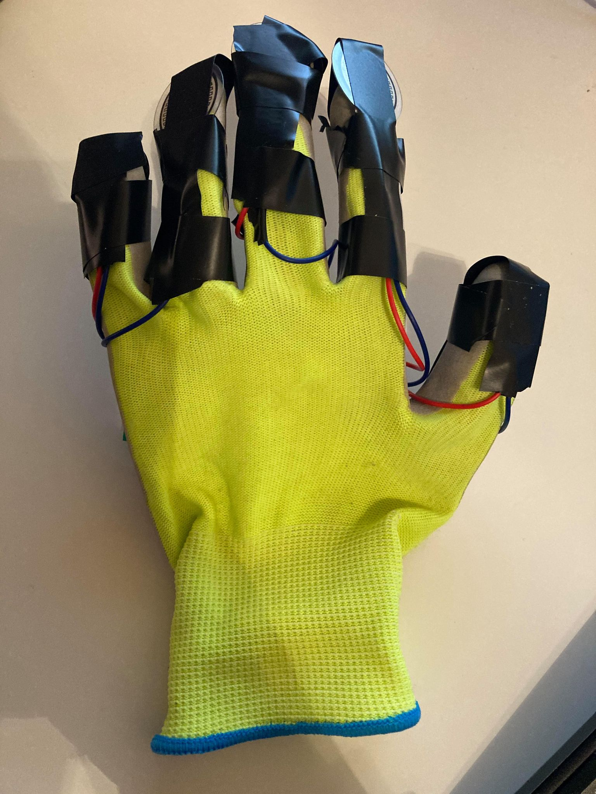
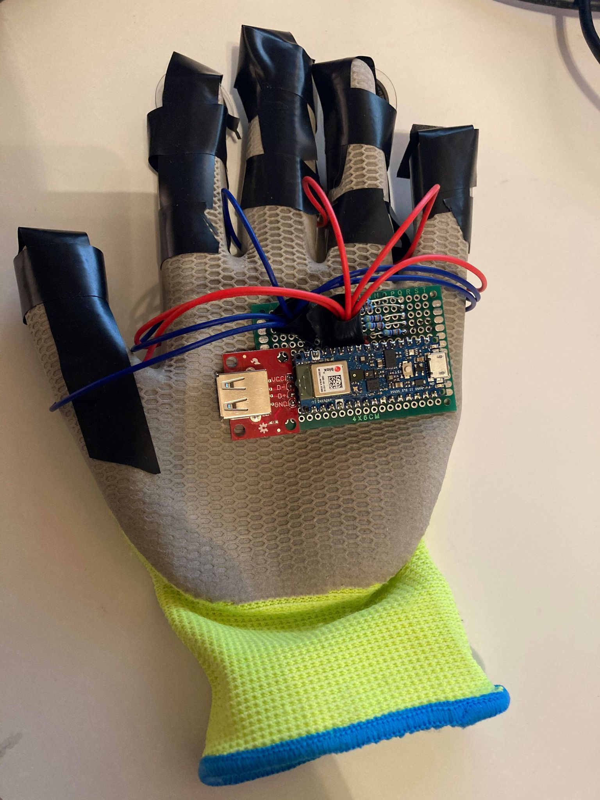
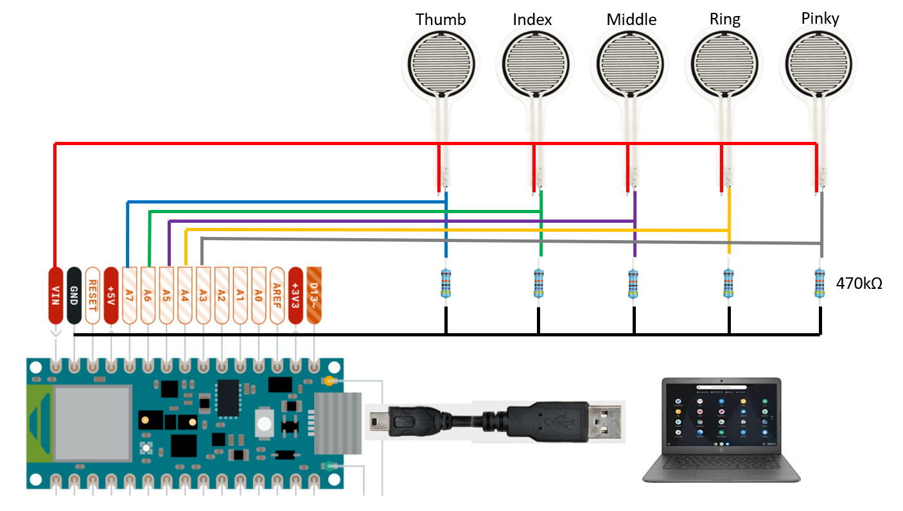
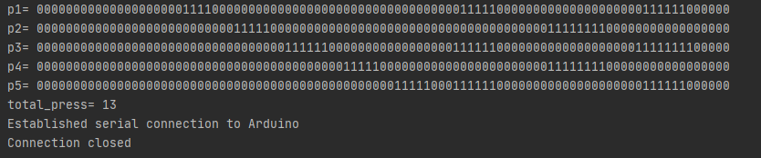
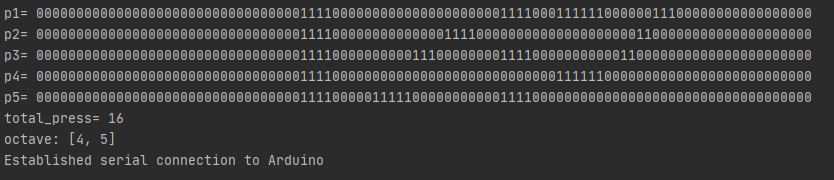

# Project: Automatic Music Page Turner

## Team Members
- Hou Pong Chan (104772329)
- Salil Akundi (804906702)

## Links
### Project Repositories
[Github](https://github.com/uclatonystark/ece202Aproj)
### Final Presentation Video
Youtube

## Project Introduction
### Motivation
Musicians have long been disadvantaged by having to turn their sheet music whilst their hands are occupied on the instrument. Professional musicians performing a complex score have typically relied on human page-turners, who must be alert and skilled to gauge the musician’s preferences.

In recent years, expensive assistive technologies involving foot pedals, voice and eye-controlled devices have emerged and grown in popularity. However, these methods rely on a gesture or action initiated by the musician to trigger a page-turn, which can be distracting in a concert setting. Further, the human and assistive approaches are both prone to error from inattention, omission or incorrect use.

In this project, we propose to solve this centuries-old problem by rendering the process of page turn entirely automatic. This is achieved by an embedded system that recognizes and maps the musician’s hand and finger movements to the music playing in real time. This makes the page-turn precise and stress-free, allowing the musicians to focus on the creative aspects of the program.

### Goal
To build an embedded system that consists of a glove and a computer to automatically turn electronic pages of sheet music in real-time
### Deliverables
A video demonstration that shows successful page turning while a player plays through a piece

## Hardware Used in This Project
- Arduino Nano 33 Sense BLE
- Force/Pressure Sensor (x5)
- Glove

## Project Timeline
- Week 4: 
  - Finalize project idea and research relevant prior literature
- Week 5: 
  - Hardware: Finish Glove Design
  - Software: Research and determine page turner software interface 
- Week 6: 
  - Hardware: Order materials and assemble + Sensor Testing
  - Software: Finalize music sheet to music note conversion 
- Week 7: 
  - Hardware: Arduino programming for finger positions detection
  - Software: Determine algorithm for matching music notes from sheet to sensor values (I)
- Week 8: 
  - Hardware: Arduino programming for fingter activation + collabration detection
  - Software: Determine algorithm for matching music notes from sheet to sensor values (II)
- Week 9: 
  - Hardware: Finalize hardware assembly and test accuracy of sensor values
  - Software: Finalize software algorithm
- Week 10: 
  - Integrate both hardware and software
- Finals Week: 
  - Final testing and report writing

## Technical Approach 
### Novelty
The main idea of our project is to extract information from a user's performance and the music being played. Using that information, user should be able to fully immerse themselves in the world of music without having to consciously click, step, or hire someone to turn page. Moreover, it constantly estimates a octave range based on player's wrist position. When user has pressed 95% of the notes within the octave range on a page, the page will be turned. 

Our project allows a wide flexiblity to user since error is loosely tracked, which means page doesn't turn in a set time. Also, unlike some other products that track audio, our project provides a better solution if multiple players play at the same time in the same room.

### Algorithm
1. **Music Score Generation**: Generate information about octave position of each note, number of notes per page from a PDF or images wiht a Collab Notebook
2. **Sensor Collection**: Monitor sensor values and IMU data (accelormeter, gyroscope, magnetometer) on glove
3. **Data Organziation**: Load information about music score and sensor values in a Python script
4. **Page Turner**: In real time, calculate number of presses and their cooresponding octave ranges and determine when to turn page using a Python script

The detail of the mentioned algorithm is displayed in the following sections.

## Music Score Generation
**Salil edit here**

## Glove Design
Due to time limit and budget constraint, we chose to focus on only one glove. Since we decided not to implement GPS or beacon localization, the only sensors are the 5 pressure sensors for each finger and the Arduino Nano 33 BLE Sense for localization and communication. The pictures of our final glove are shown below. The red USB port is for powering the glove with a battery if wireless communication is established. However, we did not achieve that due to time limit.

   
  

Palm and Back of the glove 

The PCB board placed on the back of the glove is where the Arduino and the sensing circuit are located. The circuit diagram is shown below.

    

The resistor value was chosen based on testing with the pressure sensors. Arduino code `Project__sensing.ino` was then implemented to collect pressure sensor and IMU data. The final serial output of the Arduino (pressure sensor values x5 + accel. gyro. mag.) at 10Hz will be sent to a laptop for more processing and calculations.

## Sensor Values Processing
### Number of Presses
There are five sensor values corresponding to whether each finger is being pressed or not. After information is transferred to a Python script `turningpage.py`, the sensor values are expressed in time domain.

    

As shown above, p1 to p5 represent the finger positions (thumb to pinky). '0' means that the finger is not being pressed and '1' means otherwise. The script is able to capture the transitions of each finger that goes from '1' to '0'. That is considered a press. In other words, the total number of presses can be calculated, which is useful to determine when the page should be turned.

### Octave Range
In addition to number of presses, we added a feature called 'Octave Range'. Essentially, not only should the program be able to detect the number of presses in a page, it should also measure the estimated accuracy of the notes that are played. For example, if the first three notes are in the 4th Octave, but player is pressing three notes in the 7th Octave, the software should not count those presses because they are not within the Octave Range. Octave Range is calculated using IMU data (accel, gyro, mag) to estimate a set of two Octaves where the player's wrist is approximately located at. Here, we implemented the idea of dead reckoning and assumed the starting point of a song is always somewhere between the 4th and 5th Octave. 

    

As shown above, at one instance the player's wrist is appoximated to be somewhere within the 4th and 5th Octave.

## Page Turner
forward repeat finish

## Implementation, experimental evaluation, success metrics, and key findings

## Prior work examples including references, and the relative novelty of your work

## Summary
### Strength
- Ease of use
  - User only needs to input a PDF / series of images to compile complete music score
  - Glove is sensitive enough to track each press
- Low budget
  - Comparing to other other localization, using dead reckoning with IMU and five pressure sensors is very light weight and cost efficient
  - Existed products such as pedals, clickers or human helpers are extremely expensive
- Novelty
  - Unlike other existed products, this glove can make user switch page without having to press a pedal or help from a helper

### Weakness
- Set up time
  - To prepare a music score for one piece, it takes about 10 minutes. However, user can use the same output files in conjuction with page turner without the set up
- Octave range accuracy
  - Approximating octave range using only IMU and linear acceleration, the accuracy is low and calibration is not very predictable. 
- Wired connection
  - Due to limited time, wire connection was done. Wireless glove might be ideal although a battery will have to be mounted on the glove

### Future Directions
- API and software Integration
  - Combine API and python scripts into one GUI for ease of use
- Better dead reckoning model and algorithm
  - To obtain higher octave range accuracy
- Wireless glove
  - To utlizie the BLE nature of the Arduino although error-free decoding scheme is needed which will take more time out of the real-time sensing cycle

## Contributions of Each Team Member
- Pong
  - Designed, soldered, assembled glove
  - Developed arduino firmware to collect data
  - Created Python scripts 
      1. to communicate between laptop and Arduino 
      2. to calculate and organize data including finger presses and octave range
      3. to display a functioning page turner

- Salil
  - Built API to generate music score
  - Developed Python scipts
    1. to calculate information about notes per page and octave positions
    2. to output the results to .txt, .csv, .xml files
  - Selected songs

## Section with links to PDF of your final presentation slides, and any data sets not in repo

## References
(some paper)
