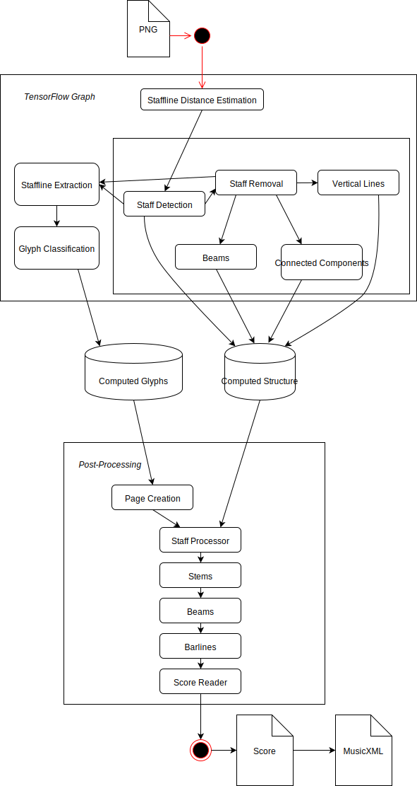
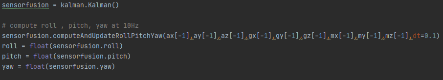
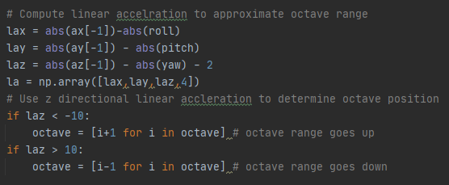
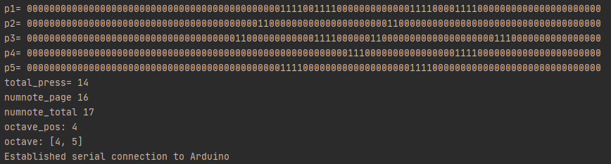
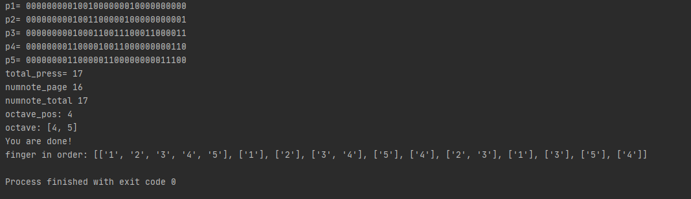

# Project: Automatic Music Page Turner

## Team Members
- Hou Pong Chan (104772329)
- Salil Akundi (804906702)

## Links
### Project Repositories
- Github: [Repo](https://github.com/uclatonystark/ece202Aproj)

### Videos
- Youtube: [Presentation](https://youtu.be/4Oe8hPP4c_U)  
- Youtube: [Demonstration](https://youtu.be/4Oe8hPP4c_U)

### Slides
- Google: [Midterm](https://drive.google.com/file/d/1Ieji-psWIU0y5LtgCtp8Dpq32jYOjGBF/view?usp=sharing)
- Google: [Final](https://drive.google.com/file/d/17NQUh9KDr1FrgY1W2HRH_Haq8b49Dw6G/view?usp=sharing)

## Project Introduction
### Motivation
Musicians have long been disadvantaged by having to turn their sheet music whilst their hands are occupied on the instrument. Professional musicians performing a complex score have typically relied on human page-turners, who must be alert and skilled to gauge the musician’s preferences.

In recent years, expensive assistive technologies involving foot pedals, voice and eye-controlled devices have emerged and grown in popularity. However, these methods rely on a gesture or action initiated by the musician to trigger a page-turn, which can be distracting in a concert setting. Further, the human and assistive approaches are both prone to error from inattention, omission or incorrect use.

In this project, we propose to solve this centuries-old problem by rendering the process of page turn entirely automatic. This is achieved by an embedded system that recognizes and maps the musician’s hand and finger movements to the music playing in real time. This makes the page-turn precise and stress-free, allowing the musicians to focus on the creative aspects of the program.

### Goal
To build an embedded system that consists of a glove and a computer to automatically turn electronic pages of sheet music in real-time
### Deliverables
A video demonstration that shows successful page turning while a player plays through a piece

## Hardware Used in This Project
- Arduino Nano 33 Sense BLE
- Force/Pressure Sensor (x5)
- Glove

## Project Timeline
- Week 4: 
  - Finalize project idea and research relevant prior literature
- Week 5: 
  - Hardware: Finish Glove Design
  - Software: Research and determine page turner software interface 
- Week 6: 
  - Hardware: Order materials and assemble + Sensor Testing
  - Software: Finalize music sheet to music note conversion 
- Week 7: 
  - Hardware: Arduino programming for finger positions detection
  - Software: Determine algorithm for matching music notes from sheet to sensor values (I)
- Week 8: 
  - Hardware: Interaction between Arduino and Python
  - Software: Determine algorithm for matching music notes from sheet to sensor values (II)
- Week 9: 
  - Hardware: Finalize hardware assembly and test accuracy of sensor values
  - Software: Finalize software algorithm
- Week 10: 
  - Integrate both hardware and software
- Finals Week: 
  - Final testing and report writing

## Review of Existing Work
**SALIL EDIT**

**Some Existing Products**
  * [STOMP Bluetooth Foot Pedal](https://www.amazon.com/STOMP-Controller-Coda-Music-Technologies/dp/B07DYFD4TR/ref=sr_1_1_sspa?dchild=1&keywords=piano+page+turner&qid=1608283446&sr=8-1-spons&psc=1&smid=A2UX0AN4VJO839&spLa=ZW5jcnlwdGVkUXVhbGlmaWVyPUEyV0dGMlVMVkcxMjMwJmVuY3J5cHRlZElkPUEwNDM5MjIxMlhBWUlUTldRWlQ5SyZlbmNyeXB0ZWRBZElkPUEwNDAwMTE3MkpXNVFaR05HMUc0UCZ3aWRnZXROYW1lPXNwX2F0ZiZhY3Rpb249Y2xpY2tSZWRpcmVjdCZkb05vdExvZ0NsaWNrPXRydWU=)
  * [Remote Page Turner](https://www.amazon.com/Bluetooth-Page-Turner-Selfie-Remote/dp/B082DJFBSW)
  * [Timer Page Turner](https://www.amazon.com/Turning-Wireless-Controller-Multifunctional-Bluetooth/dp/B07W92ZMDL)
  
## Technical Approach 
### Novelty
This page turner relies solely on the process of playing the piano with the hands and is the first fully automatic page turner that does not rely on audio. The fact that it does not rely on audio is particularly useful as it means that it can be used in concert settings where there are multiple instruments being played at the same time. The page turner software also allows reasonable room for mistakes during a recital by the musician, thus making the page turning process even more stress-free.  

Another novel aspect of the page turner is its customizability, in particular, the ability to add custom fingerings for individual notes. The musician may chose to add fingerings for individual notes prior to the concert and specify the number of notes desired to be played in a trill or tremolo. Moreover, the easy-to-edit format of the note encodings means that the musician can easily delete or add notes wherever desired. This further increases the accuracy of the page-turner.

### Algorithm
1. **Optical Music Recognition**: Extracts information about the overall piece (such as tempo, time signature, etc.), each note (including octave position and fingering), type of note indicated (trills, tremolo, glissandi, etc.), number of notes per page from sheet music in PDF or image format.
2. **Sensor Collection**: Monitor sensor values and IMU data (accelormeter, gyroscope, magnetometer) on glove.
3. **Data Organziation**: Loads information about music score and sensor values.
4. **Page Turner**: In real time, calculates number of presses and their cooresponding octave ranges and determines when to turn the page.

The following sections expand on each part of the project:

## Optical Music Recognition
Before the page-turner is even used, some preprocessing must be done. In particular, the user must upload a pdf page or a png file of the music score as an input to a script. This script performs uses Tensorflow's Moonlight engine to perform optical music recognition. The below picture, taken from Tensorflow's Moonlight repository outlines this process:
<p float="left" align="center">

</p>
**SALIL EDIT TEXT HERE**

## Glove Design
Due to time and budget constraints, we chose to focus on only one glove. Since we decided not to implement GPS or beacon localization, the only sensors are the 5 pressure sensors for each finger and the Arduino Nano 33 BLE Sense for localization and communication. The pictures of our final glove are shown below. The red USB port is for powering the glove with a battery if wireless communication is established. However, we did not achieve that due to time constraints. 
<p float="left" align="center">
   
  
</p>
<p align="center">Palm and Back of the glove </p>

The PCB board placed on the back of the glove is where the Arduino and the sensing circuit are located. The circuit diagram is shown below.
<p float="left" align="center">
    
</p>
The resistor value was chosen based on testing with the pressure sensors. Arduino code `Project__sensing.ino` was then implemented to collect pressure sensor and IMU data. The final serial output of the Arduino (pressure sensor values x5 + accel. gyro. mag.) at 10Hz will be sent to a laptop for more processing and calculations.

## Sensor Values Processing
### Number of Presses
There are five sensor values corresponding to whether each finger is being pressed or not. After this information is transferred to a Python script `turningpage.py`, the sensor values are expressed in time domain.
<p float="left" align="center">
    
</p>
As shown above, p1 to p5 represent the finger positions (thumb to pinky). '0' means that the finger is not being pressed and '1' means otherwise. The script is able to capture the transitions of each finger that goes from '1' to '0'. That is considered a 'press'. In other words, the total number of presses can be calculated, which is used to determine when the page should be turned.

### Octave Range
In addition to the number of presses, we added a feature called 'Octave Range'. Essentially, not only should the program be able to detect the number of presses in a page, it should also measure the estimated accuracy of the notes that are played. For example, if the first three notes are in the 4th Octave, but the player is playing three notes in the 7th Octave, the software should not count those presses because they are not within the Octave Range. The Octave Range is calculated using IMU data (accel, gyro, mag) to estimate a set of two Octaves where the player's wrist is approximately located at. Here, we implemented the idea of dead reckoning and assumed that the starting point of a piece is always somewhere between the 4th and 5th Octave. 

Roll, Pitch, and Yaw are calculated using Extended Kalman Filter using an existed Python Library. 
```python
from imusensor.filters import kalman
```
<p float="left" align="center">
    
</p>
Then we estimated the linear accelerations to be some linear functions of the accelerometer values and RBY. After testing, we concluded that if the z-directional linear accerlation goes to a specific threshold, the octave range increases or decreases by 1.
<p float="left" align="center">
    
</p>
As shown below, at one instance the player's wrist is appoximated to be somewhere within the 4th and 5th Octave.
<p float="left" align="center">
    
</p>

## Page Turner
Finally, the page turner combines the data from music score, number of presses, and Octave Range to compute four things: 
- num_note_turn = number of acceptable presses required for page to turn (95% of total notes on that page)
- num_note_tot = total number of possible presses (notes) on a page
- fb = whether page should go forward (next line) or backward (repeat)
- num_page_turn = the number of pages turned forward or backward

The total output looks like this:
<p float="left" align="center">
    
</p>
When total_press >= num_note_page, the page will be turned backwards or forwards based on the provided instructions in the music score.

## Results
### Evaluation
We designed a evaluation system that considers the user's 'performance'. Since other aspects of music cannot be quantified, we solely use accuracy in notes played in order to quantify performance. In particular, we place special emphasis on the accuracy in notes played at the end and start of pages as these typically tend to be the bulk of mistakes when a page turn is performed manually.

This system evaulates the finger(s) user chose to use to play the whole piece in order in time domain. It then compares this against the fingering chosen by the user prior to the concert or the fingering indicated in the music score. One instance is shown below:
<p float="left" align="center">
    
</p>

Since this page-turner was intended for use in concert, a comparison in a low-pressure setting (at home) was not performed. However, we believe that without the distraction of manually turning a page, the user can focus their full attention on the creative aspects of the music program.

### Key Findings
**What worked?**
- The page turning process was smooth.
- Optical music recognition was accurate for electronic music sheets.
- Pressure sensing was very accurate.
- Evaluation process was smooth and precise.

**What didn't work as expected?**
- Linear acceleration calculation was not as reliable as we hoped.
- A pressure sensor is about as large as a key, which made playing challenging. However, this has to do more with the choice of pressure sensor which we made, due to shipping and time constraints as a result of COVID-19.
- Optical music recognition was inaccurate for certain (old) scanned sheets of music.

## Summary
### Strengths
- Ease of use
  - User only needs to input a PDF / series of images to compile complete music score.
  - Glove is sensitive enough to track each press
- Low budget
  - Compared to  other localization, using dead reckoning with IMU and five pressure sensors is very light weight and cost efficient.
  - Existed products such as pedals, clickers and mechanical levers are extremely expensive (with a significant number of products costing upwards of $200). 
- Novelty
  - Unlike existing products, this page-turner is fully automatic and relies solely on the process of playing.
- Accuracy
  - This page turner does not suffer from external noise as an audio-based page-turner does. Further, it can be used in concerts where there are multiple instruments being played at the same time.

### Weaknesses
- Preprocessing time
  - The user must upload pdf files onto the program for preprocessing (prior to the recital, for instance). It takes about 2 minutes to generate an output per page as optical music recognition is complex. However, this is a one-time step and does not have to be repeated.
- Octave range accuracy
  - Approximating octave range using only IMU and linear acceleration, the accuracy is low (the current range is 2 octaves).
- Wired connection
  - Due to limited time, wire connection was done. Wireless glove might be ideal although a battery will have to be mounted on the glove.

### Future Directions
- API and software Integration
  - Combine the entire page-turner into one app for ease of use.
- Better dead reckoning model and algorithm
  - To obtain higher octave range accuracy.
- Wireless glove
  - To utilize the BLE nature of the Arduino although error-free decoding scheme is needed which will take more time out of the real-time sensing cycle.
- Improved mechanical design
  - With flex PCB or smaller sensors, we hope that the glove will have more stability and a more appealing appearance.

## Contributions of Each Team Member
- Pong
  - Designed, soldered, assembled glove
  - Developed arduino firmware to collect data
  - Created Python scripts 
      1. to communicate between laptop and Arduino 
      2. to calculate and organize data including finger presses and octave range
      3. to display a functioning page turner

- Salil
  - Came up with the overall idea for the project
  - Developed optical music recognition pipeline from pdf/image files to note-level details
  - Added custom functionality including user-defined fingering, trills, repeats, etc.
  - Designed test data by notating and annotating scores

## References
- Using Inertial Sensors for Position and Orientation Estimation: [link](https://arxiv.org/pdf/1704.06053.pdf)
- Dead Reckoning Algorithms for Indoor Localization: [link](https://core.ac.uk/reader/48656890)
- Page Turning Solutions for Musicians: A Survey: [link](https://www.researchgate.net/publication/221748599_Page_turning_solutions_for_musicians_A_survey)

